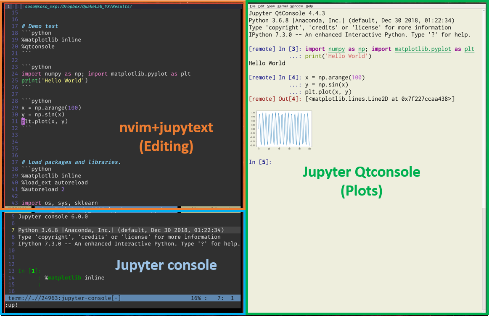
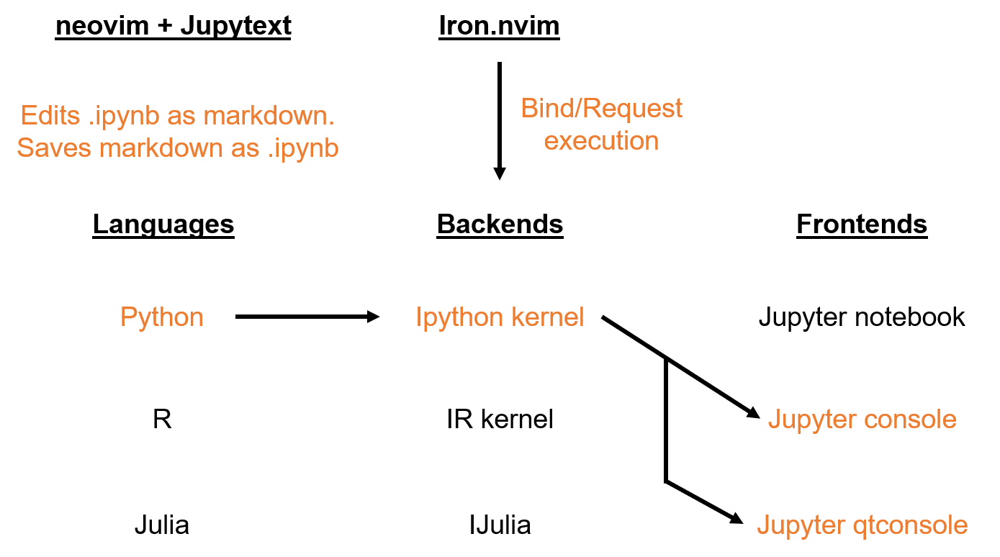
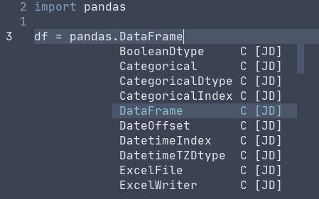
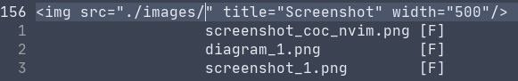
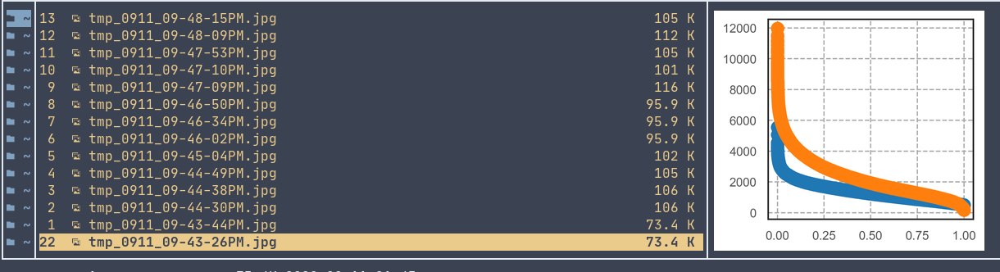

SOSODE: A speedy environment for interactive data science.
=======================================================
SOSODE is a neovim-based development environment for interactive data analysis and scripting. It combines the performance and flexibility of vim with the enriched functionality of Jupyter by hacking together a list of tools developed by others. Here, I provide a setup guide and a list of configurations to make it easy to transition from Jupyter-notebook / Jupyter-lab environment.

\
**Screenshot of SOSODE**




Thanks to the contributors who made the following tools, we can turn vim into a powerful IDE for interactive data analysis:
+ [neovim (Optional if using vimcmdline)](https://neovim.io/)
+ [vimcmdline (forked from jalvesaq/vimcmdline)](https://github.com/xuesoso/vimcmdline.git)
+ [iron.nvim (Alternative)](https://github.com/Vigemus/iron.nvim)
+ [completor](https://github.com/maralla/completor.vim)
+ [pynvim](https://github.com/neovim/pynvim)
+ [jupytext](https://github.com/mwouts/jupytext)

Updates
-------
+ 7/19/2019: Added "setup_SOSODE.sh" for automatic setup of configuration. Modularized the config setup. Instead of appending lines from "SOSODE_vimrc" to user .vimrc, we will keep SOSODE_vimrc separate and append a source call in the user vimrc. This prevents pollution of the user's original vimrc, and is much easier for uninstallation / reinstallation of SOSODE configuration.
+ 7/11/2019: switched REPL interpreter from iron.nvim to vimcmdline because it seems to play nicer with jupyter-console. Also switched from autocompletor to maralla/completor as it is less buggy.

Installation
------------
Clone this repository to a directory where you can work with.
```bash
git clone https://github.com/xuesoso/SOSODE
```


**Optional**: If you don't have neovim, I suggest installing [neovim](https://github.com/neovim/neovim/wiki/Installing-Neovim). It is an improved vim with much more streamlined code base and has added support for Read-Eval-Print-Loop (REPL) functionality that iron.nvim depends on. If you use vimcmdline instead of iron.nvim, you can use either vim 8.0+ or neovim.

### Summary of neovim installation: 

#### **macOS**
```bash
brew install neovim
```

#### **Arch/Manjaro Linux**
```bash
sudo pacman -S neovim
```

#### **Ubuntu/Debian Linux**
```bash
sudo apt-get install neovim
```

Configuration
-------------
**I have added "setup_SOSODE.sh" script to automatically complete some of the following steps. All you need to run in terminal:**
```bash
sh setup_SOSODE.sh
```

<details><summary>Manual setup</summary> <p>
**Optional:** If you installed neovim, we can easily link up your existing vimrc configuration. Just copy my nvim configuration files over. You can paste and execute the following line in terminal.

### Install vundle for vim plugin management
If you don't already have a plugin management system for vim, then I highly recommend installing vundle.

```bash
git clone https://github.com/VundleVim/Vundle.vim.git ~/.vim/bundle/Vundle.vim
```

### pip installation

Next, you will need to install jupytext, pynvim, jupyter-console, and jupyter-qtconsole with pip (Python 3)
```bash
pip install jupytext pynvim jupyter-console qtconsole
```

```bash
cp -r .config/* ~/.config
```

I modified jupyter console to suppress image output when using the inline magic in jupyter console, that way the images don't clump up your whole screen. We also need to enable remote input to be fed into jupyter-qtconsole. Run the following bash script in terminal to include to make the relevant changes in jupyter folder. 

```bash
mkdir -p ~/.jupyter && cp -r .jupyter/* ~/.jupyter/
```

Finally, to set up the proper plugins you will append my vimrc lines to your own vimrc. If you are reinstalling SOSODE, take care to not duplicate lines of vim configurations.
```bash
mv SOSODE_vimrc $HOME/.SOSODE_vimrc
vim_call="source $HOME/.SOSODE_vimrc"
if grep -qF "$vim_call" $HOME/.vimrc;
    then
        echo "vim source line already exists in $HOME/.vimrc";
    else
        echo "$vim_call" >> $HOME/.vimrc && echo "added source line to $HOME/.vimrc";
fi
```
</p> </details>

**Optional:** I add in my .bashrc or .bash_profile with an alias to call neovim with "v".
```bash
alias v='nvim -o'
```

#### Install all plugins via Vundle
In vim, install plugins
```vim
:PluginInstall<CR>
```

In nvim, install plugins and also run checkhealth
```vim
:PluginInstall<CR>
:UpdateRemotePlugins<CR>
:checkhealth<CR>
```

You are all set up!

Usage
-----

### Editing jupyter-notebook
You can edit an jupyter-notebook (*.ipynb) by simply calling

```bash
nvim notebook.ipynb
```

Notebook is automatically converted to markdown, where cell structures are encapsulated by markdown code block. You can edit the code and text in this markdown buffer. By default, the markdown will be shown with python syntax.

### Saving jupyter-notebook 
Just save as usual in vim (:w<CR>). Jupytext will update the original .ipynb file with changes made in the markdown buffer without altering the outputs in the notebook.

### Interactive iPython
#### Initiating the python REPL
If you are on vimcmdline (default), pressing Leader-s in normal mode will initiate a jupyter-console / ipython kernel. If you are on iron.nvim (alternative), submitting a line of code will automatically initiate an instance if it does not yet already exist for your current file. Both of these REPL plugins should automatically detect the current environment that you are in and point to the correct python.

#### Execute current line with Space
By default, pressing Space key will submit the current line of code to an ipython kernel.

#### Execute entire cell block with Alt-s
By default, pressing Alt-s will submit the entire cell block for execution encapsulated by cell block markers.

#### Inline plots
In either your script or jupyter console, you can invoke inline plotting by calling
```python
%matplotlib inline
%qtconsole
```
This will link an instance of jupyter-qtconsole to ipython kernel and allows inline display of figures. You can also save all the interactions as html using the embedded jupyter-qtconsole function.

Additional tools that I find useful
-----

#### Asynchronous VSCode-like language support, hinting, and linting
Check out plugins [coc.nvim](https://github.com/neoclide/coc.nvim) and its python extension called [coc-python](https://github.com/neoclide/coc-python). Requires neovim and takes a little bit of time to set up for the first time, but the result is well worth it.

**Package method suggestion**



**Path suggestion**



#### Ranger + Ueberzug for in terminal plot viewing
I like to view my plots inside terminal without having to open another program. [Ranger](https://github.com/ranger/ranger) and [Ueberzug](https://github.com/seebye/ueberzug) are great tools to achieve that.

**Viewing plots in terminal**



Known issues
-----
**Gnome + ipython**: On Gnome 3.34 or more recent version of its desktop environment, subprocess ownership is different than other desktop environments. What this means is that when you close a terminal application or vim window pane that is running ipython / jupyter_console, the orphaned frontend will not shut down on its own which can cause additional resource usage. You would not notice unless you check on your process list. I would test by opening a ipython / jupyter_console kernel and force close the terminal app that it's running on. Next type and enter:
```bash
ps aux | grep 'ipykernel'
``` 
and see if it returns a running process in the background. If it shows then that means the kernel is still running despite its parent process being killed just now.
This happens because of the different way in which Gnome 3.34+ handles orphaned processes and that "ipykernel" assumes init as the root parent for all processes (which is not true in Gnome 3.34+). For more details on this issue, you can see [here](https://github.com/ipython/ipykernel/issues/517). A solution for now would be to close down the ipython/jupyter_console frontend with "quit" command in its console.


