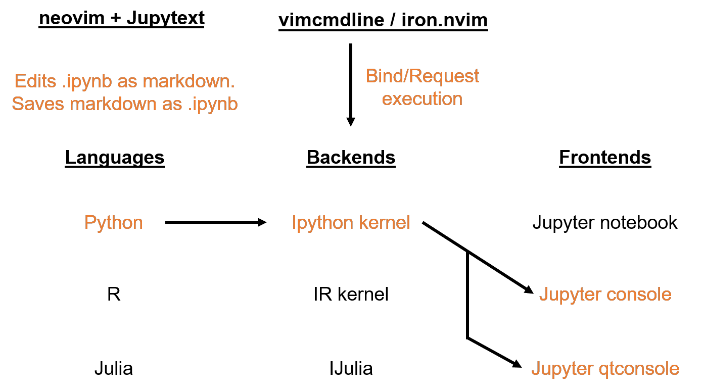

SOSODE: A speedy environment for interactive data science.
=======================================================
SOSODE is a neovim-based development environment for interactive data analysis and scripting. It combines the performance and flexibility of vim with the enriched functionality of Jupyter by hacking together a list of tools developed by others. Here, I provide a setup guide and a list of configurations to make it easy to transition from Jupyter-notebook / Jupyter-lab environment.

\
**Screenshot of SOSODE**




Thanks to the contributors who made the following tools, we can turn vim into a powerful IDE for interactive data analysis:
+ neovim
+ iron.nvim
+ pynvim
+ deoplete
+ jupytext


Installation
------------
Clone this repository to a directory where you can work with.
```bash
git clone https://github.com/xuesoso/SOSODE
```


First, if you don't have neovim, then install [neovim](https://github.com/neovim/neovim/wiki/Installing-Neovim). It is an improved vim with much more streamlined code base and has added support for Read-Eval-Print-Loop (REPL) functionality that iron.nvim depends on.

### Summary of neovim installation: 

#### **macOS**
```bash
brew install neovim
```

#### **Arch Linux**
```bash
sudo pacman -S neovim
```

#### **Debian Linux**
```bash
sudo apt-get install neovim
```

### Install vundle for vim plugin management
If you don't already have a plugin management system for vim, then I highly recommend installing vundle.

```bash
git clone https://github.com/VundleVim/Vundle.vim.git ~/.vim/bundle/Vundle.vim
```

### pip installation

Next, you will need to install jupytext and pynvim with pip (Python 3)
```bash
pip install jupytext pynvim
```

### Jupyter installation
If you use anaconda distribution, typically the following jupyter frontends might already be installed. If not, copy and paste
```bash
conda install -c conda-forge jupyter-console && conda install qtconsole
```

Configuration
-------------
We can easily link up your existing vimrc configuration to neovim. Just copy over my nvim configuration files over. You can paste and execute the following line in terminal.

```bash
cp -r .config ~/.config
```

I modified jupyter console to suppress image output when using the inline magic in jupyter console, that way the images don't clump up your whole screen. Include this in your jupyter folder

```bash
mkdir -p ~/.jupyter && cp -r .jupyter/ ~/.jupyter/
```

**Optional:** I add in my .bashrc or .bash_profile with an alias to call neovim with "v".
```bash
alias v='nvim -o'
```

Finally, to set up the proper plugins you will append my vimrc lines to your own vimrc
```bash
if [ -e ~/.vimrc ]
then
    cp SOSODE_vimrc ~/.vimrc
else
    cat SOSODE_vimrc >> ~/.vimrc
fi
```

#### Install all plugins via Vundle
In nvim, install plugins and run checkhealth
```vim
:PluginInstall<CR>
:checkhealth<CR>
```

You are all set up!

Usage
-----

### Editing jupyter-notebook
You can edit an jupyter-notebook (*.ipynb) by simply calling

```bash
nvim notebook.ipynb
```

Notebook is automatically converted to an instance of markdown, where cell structures are encapsulated by markdown code block. You can edit the code and text in this markdown buffer. By default, the markdown will be shown with python syntax.

### Saving jupyter-notebook 
Just save as usual in vim (:w<CR>). Jupytext will update the original .ipynb file with changes made in the markdown buffer without altering the outputs in the notebook.

### Interactive iPython
#### Execute current line with Alt-d
By default, pressing Alt-d key will submit the current line of code to an ipython kernel, initiating an instance if it does not yet already exist for your current file. This is done via iron.nvim, and it will automatically detect the current environment you are in.

#### Execute entire cell block with Alt-s
By default, pressing Alt-s will submit the entire cell block for execution.

#### Inline plots
In either your script or jupyter console, you can invoke inline plotting by calling
```python
%matplotlib inline
%qtconsole
```
This will link an instance of jupyter-qtconsole linked to the same ipython kernel and allows inline display of figures. You can also save all the interactions as html using the embedded jupyter-qtconsole function.

